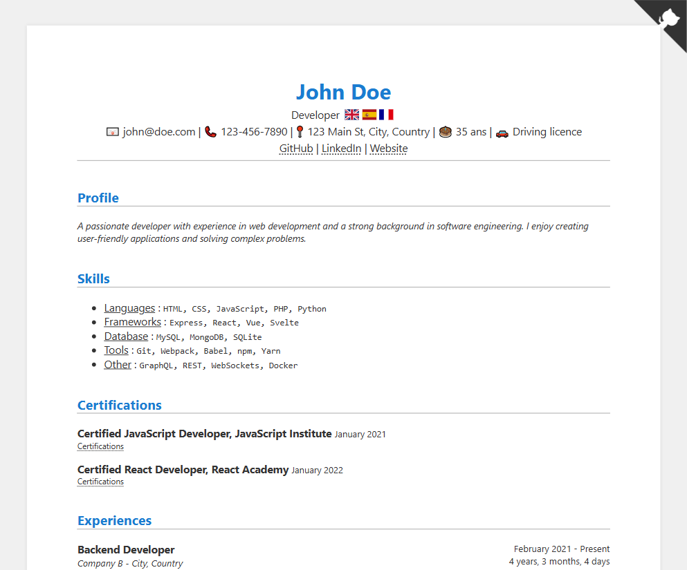

# 👨‍💼 Online Resume

## In French

### Introduction

En poste en entreprise depuis un peu plus d'un an, j'ai souhaité actualiser mon *curriculum vitae* (CV) afin d'y intégrer les compétences, expériences et informations acquises récemment. Plutôt que de mettre à jour mon diaporama PowerPoint habituel qui me sert de CV, j'ai eu l'idée de créer un site Internet faisant office de CV en ligne. Réalisé en quelques jours grâce au *framework* [Svelte](https://svelte.dev/) ✨, ce projet, sans prétention sur le plan des fonctionnalités, repose néanmoins sur trois objectifs principaux :

1. Offrir une **personnalisation rapide**, même pour les personnes disposant de peu de connaissances techniques ;
2. Garantir une **lecture simple et agréable** pour les recruteurs ou tout autre visiteur ;
3. Proposer un **site dynamique**, capable de s'adapter à différents supports (ordinateur, mobile, export en PDF, etc.).

Le premier objectif a été atteint grâce à l'utilisation d'un fichier JSON, qui permet de modifier facilement l'ensemble des contenus sans toucher au code source. Le deuxième est rempli à travers une mise en page épurée, inspirée des CV traditionnels réalisés réalisé sous Word ou Figma. Enfin, le troisième a été concrétisé par l'intégration de QR codes et d'icônes, facilitant l'accès aux liens lors d'une impression ou d'une exportation en PDF, bien plus efficacement que de simples URL en texte brut.

> [!IMPORTANT]
> L'entièreté du code de ce projet est commenté dans ma langue natale (en français) et n'est pas voué à être traduit en anglais par soucis de simplicité de développement.

### Installation

> [!WARNING]
> Le déploiement en environnement de production nécessite un serveur Web déjà configuré comme [Nginx](https://nginx.org/en/), [Apache](https://httpd.apache.org/) ou [Caddy](https://caddyserver.com/) pour servir les fichiers statiques générés par Vite.

#### Développement local

- Installer [NodeJS LTS](https://nodejs.org/) (>20 ou plus) ;
- Installer les dépendances du projet avec la commande `npm install` ;
- Démarrer le serveur local Vite avec la commande `npm run dev` ;
- Modifier le fichier `src/data/default.json` pour changer le contenu du site Internet en vous aidant du fichier `src/data/_example.json`.

#### Déploiement en production

- Installer [NodeJS LTS](https://nodejs.org/) (>20 ou plus) ;
- Installer les dépendances du projet avec la commande `npm install` ;
- Modifier le fichier `src/data/default.json` pour changer le contenu du site Internet en vous aidant du fichier `src/data/_example.json` ;
- Compiler les fichiers statiques du site Internet avec la commande `npm run build` ;
- Utiliser un serveur Web pour servir les fichiers statiques générés à l'étape précédente.

> [!TIP]
> Pour tester le projet, vous *pouvez* également utiliser [Docker](https://www.docker.com/). Une fois installé, il suffit de lancer l'image Docker de développement à l'aide de la commande `docker compose up --detach --build`. Le site devrait être accessible à l'adresse suivante : http://localhost:5173/. Si vous souhaitez travailler sur le projet avec Docker, vous devez utiliser la commande `docker compose watch --no-up` pour que vos changements locaux soient automatiquement synchronisés avec le conteneur. 🐳

> [!CAUTION]
> L'image Docker **ne peut pas** et **n'a pas été conçue** pour fonctionner dans un environnement de production. Ce projet génère des fichiers statiques que **vous devez** servir avec un serveur Web déjà configuré et respectant aux bonnes pratiques de sécurité et d'optimisation. ⚠️

## In English

### Introduction

After working for a company for a little over a year, I wanted to update my resume to include recently acquired skills, experience and contact information. Instead of updating my usual PowerPoint slideshow, which serves as my resume, I came up with the idea of creating a website to act as an online resume. Completed in just a few days thanks to [Svelte](https://svelte.dev/) ✨, this project, unpretentious in terms of functionalities, is nevertheless based on three main objectives:

1. **Fast customization**, even for people with little technical knowledge ;
2. **Ensure easy, pleasant reading** for recruiters and other visitors ;
3. Offer a **dynamic site**, capable of adapting to different media (computer, mobile, PDF export, etc.).

The first target has been achieved by using a JSON file, which makes it easy to modify all content without altering the source code. The second was fulfilled through a streamlined layout, inspired by traditional resumes created in Word or Figma. Finally, the third has been realized by integrating QR codes and icons, making links easier to access when printing or exporting to PDF, much more efficiently than simple plain-text URLs.

> [!IMPORTANT]
> The whole code of this project is commented in my native language (in French) and will not be translated in English for easier programming.

### Setup

> [!WARNING]
> Deployment in a production environment requires a pre-configured web server such as [Nginx](https://nginx.org/en/), [Apache](https://httpd.apache.org/), or [Caddy](https://caddyserver.com/) to serve the static files generated by Vite.

#### Local development

- Install [NodeJS LTS](https://nodejs.org/) (>20 or higher) ;
- Install project dependencies using `npm install` ;
- Start Vite local server using `npm run dev` ;
- Edit `src/data/default.json` to change the website content, using the `src/data/_example.json` file as a reference.

#### Production deployment

- Install [NodeJS LTS](https://nodejs.org/) (>20 or higher) ;
- Install project dependencies using `npm install` ;
- Edit `src/data/default.json` to change the website content, using the `src/data/_example.json` file as a reference ;
- Build static website files using `npm run build` ;
- Remove development dependencies using `npm prune --omit=dev` ;
- Use a web server to serve the static files generated in the previous step.

> [!TIP]
> To try the project, you *can* also use [Docker](https://www.docker.com/) installed. Once installed, simply start the development Docker image with `docker compose up --detach --build` command. The website should be available at http://localhost:5173/. If you want to work on the project with Docker, you need to use `docker compose watch --no-up` to automatically synchronize your local changes with the container. 🐳

> [!CAUTION]
> The Docker image **cannot** and **was not designed** to run in a production environment. This project generates static files that must be served with a pre-configured web server adhering to security and optimization best practices.

